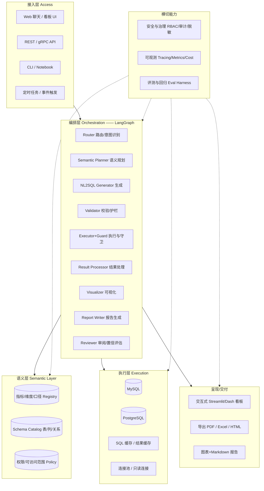
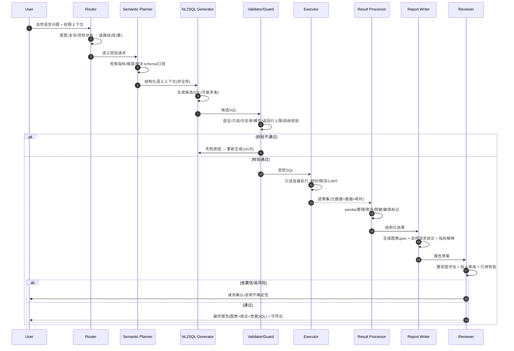
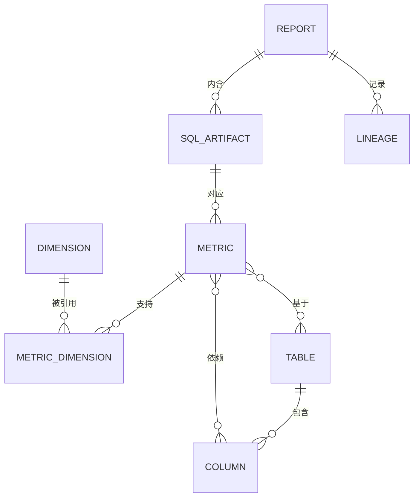
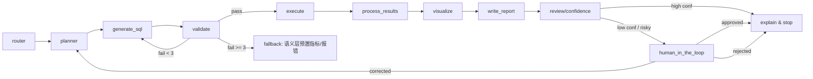

# 数据库智能报表 Agent — 生产级设计文档

> **一句话定位**：一个"问数据、出报告"的 Agent——用户用自然语言提问，Agent 自动查询关系型数据库（MySQL/PostgreSQL），生成可信的 SQL、图表与结论，最终交付可交互的仪表盘/报告。**既能本地一键演示，又能生产落地**。

> 📌 **实现状态（v1.0.0 完整基线）**：`src/dbreport/` 已落地本设计第 7/8/9/12 节核心——语义层、护栏、执行层、呈现层、编排层（**轻/重双路径**：轻路径走预置口径，重量路径由 LLM 生成 SQL → 护栏校验重试 → LLM 洞察）、LLM 接入（OpenAI 兼容，标准库实现）、评测 harness（黄金集 + 命中/执行/护栏拦截回归）。28 个单元测试 + 评测回归全绿，CLI 端到端可跑。`git tag v1.0.0` 为完整基线，后续需求在此之上迭代、可回退。LangGraph 编排、HITL、云上部署等按路线图（第 18 节）推进。

---

## 目录

1. [文档性质与阅读对象](#1-文档性质与阅读对象)
2. [背景、问题与目标](#2-背景问题与目标)
3. [非目标（明确不做）](#3-非目标明确不做)
4. [术语与角色](#4-术语与角色)
5. [参考产品分析（GitHub 开源调研）](#5-参考产品分析github-开源调研)
6. [总体架构](#6-总体架构)
7. [核心工作流（Agent 管线）](#7-核心工作流agent-管线)
8. [模块设计](#8-模块设计)
9. [元数据与语义建模](#9-元数据与语义建模)
10. [Agent 编排（LangGraph 状态机）](#10-agent-编排langgraph-状态机)
11. [关键设计决策（含取舍理由）](#11-关键设计决策含取舍理由)
12. [安全与治理](#12-安全与治理)
13. [评测与回归体系](#13-评测与回归体系)
14. [可靠性、可观测性与性能](#14-可靠性可观测性与性能)
15. [成本控制](#15-成本控制)
16. [部署与运维（本地演示 → 云端生产）](#16-部署与运维本地演示--云端生产)
17. [演示方案（如何证明"能演示"）](#17-演示方案如何证明能演示)
18. [生产落地路线图](#18-生产落地路线图)
19. [成功指标（KPI）](#19-成功指标kpi)
20. [风险与开放问题](#20-风险与开放问题)
21. [附录](#21-附录)

---

## 1. 文档性质与阅读对象

- **性质**：面向**真实交付**的系统设计文档，不是课程作业。它描述"怎么把它做成一个可持续运行、可维护、可评测、可审计的生产系统"。
- **阅读对象**：
  - **工程师**：架构决策、模块接口、编排图、评测与运维。
  - **数据/BI 负责人**：语义层设计、安全与权限、治理。
  - **产品/运营**：用户旅程、演示脚本、KPI。
  - **甲方/管理层**：范围、风险、路线图、合规边界。
- **技术基线**：Python 3.12 · LangGraph · MySQL/PostgreSQL · Streamlit 交互式看板 · Docker Compose（本地演示）。
- **附带产物**：本仓库 `demos/` 提供最小可运行骨架，`docs/DESIGN.md` 描述完整生产架构。二者是"同一套设计的两端"——骨架即可运行，完整架构用于落地。

---

## 2. 背景、问题与目标

### 2.1 问题

组织里数据量大、口径复杂，但"用数据决策"的门槛太高：

1. **SQL 门槛**：业务同事不懂 SQL；懂 SQL 的人不懂业务口径。
2. **口径不一致**：同一指标（如"活跃用户"）在不同部门定义不同，报表对不上。
3. **重复劳动**：取数、画图、写结论每周重复做。
4. **信任问题**：AI 生成的 SQL 与结论不可信、不可审计、不知道对错。
5. **一次性**：结果只是截图/Excel，无法复现、无法沉淀。
6. **合规风险**：AI 直接跑库，可能误改数据、越权取数、泄露敏感字段。

### 2.2 目标

构建一个 **`db-report-agent`**，让业务用户：

- 用中文/英文**自然语言提问** → 自动生成**合理、安全的 SQL** → 执行 → **自动画图 + 自然语言结论** → 交付**可交互仪表盘/可导出报告**。
- 全程**可解释、可审核、可回放、可评测**。
- 既能在**本地一条命令跑起来演示**，也能按同一架构**部署到生产**。

### 2.3 关键诉求（"生产落地" vs "demo" 的分水岭）

| 能力 | Demo 水平 | 生产水平（本文目标） |
|---|---|---|
| SQL 正确性 | 靠提示词"蒙" | 结构化语义层 + schema 感知 + 语法/血统校验 + 评测回归 |
| 数据安全 | 直接连库跑 | 只读强制 + 行级/列级权限 + 脱敏 + 审计 + 白名单 |
| 结果可复现 | 每次漂移 | 确定性、幂等、可回放（记录问题+SQL+参数+版本） |
| 可评估 | 无 | 离线评测集 + 执行准确率/幻觉率回归 + LLM-as-judge |
| 可观测 | 无 | tracing（问题→SQL→数据→图表全链路）、成本/耗时 meter |
| 失败处理 | 报错中断 | 重试、退化、HITL 复核、错误码标准化 |
| 沉淀复用 | 无 | 语义层指标/维度/口径持续沉淀，越用越准 |

---

## 3. 非目标（明确不做）

把范围界定清楚，避免"看似全能实则都做不好"：

- ❌ **不做实时 OLTP 写入/事务**：只读分析，禁止 DML/DDL。
- ❌ **不做通用数据工程管道**（ETL、CDC、数仓建模）：只做"查询 + 呈现"；数据质量由上游负责，本系统做**接入与语义映射**。
- ❌ **不做通用 chatbot**：聚焦"数据问答 + 报告"，不闲聊。
- ❌ **不做企业级 BI 的全部功能**（复杂钻取、行级超大规模 OLAP 编排、复杂权限矩阵全面替代）：初期以"可信的 text-to-SQL + 仪表盘"为核心。
- ❌ **不保证 100% 准确**：这不可能；本文通过**语义层 + 校验 + 评测 + HITL**把准确率与可审计性做高，并诚实标注置信度。
- ❌ **不替代人类决策**：Agent 给结论与依据，人来做判断（Audit + Human-in-the-loop）。

---

## 4. 术语与角色

| 术语 | 定义 |
|---|---|
| **NL2SQL** | Natural Language → SQL，把自然语言转成可执行 SQL |
| **语义层（Semantic Layer）** | 业务口径的"唯一权威定义"，把表/字段映射成指标、维度、类别（如 `revenue_metric`、`date_dim`） |
| **Schema 感知** | 生成 SQL 时基于"用到哪些表/列"的精确 schema，而非整库塞进上下文 |
| **血缘（Lineage）** | 问题 → 指标 → 表/列 → SQL → 结果 的溯源关系，用于审计与"为什么是这个数" |
| **Guardrails（护栏）** | SQL 生成后、执行前的一系列安全/合规/正确性校验 |
| **HITL** | Human-in-the-loop，关键/高风险环节人工复核 |
| **Tracing** | 一次请求从进入系统到出报告的全链路记录 |
| **Eval harness** | 离线评测系统，用标注集持续测准确率/幻觉率，防回归 |

**系统角色**：

- **提问者（End User）**：业务同事、分析师、管理层。
- **数据管理员（Data Admin）**：维护语义层、数据源、权限、可访问范围。
- **审核员（Reviewer）**：对高风险/低置信结果做人工复核与打标（生产版有）。
- **Agent（本系统）**：编排、查询、生成、呈现。

---

## 5. 参考产品分析（GitHub 开源调研）

设计不是拍脑袋，这里调研了**直接对标**的开源实现，并提炼"哪些做法值得吸收 / 哪些坑要避开"。

### 5.1 对标产品一览

| 项目 | 链接 | 关键特点 | 对本设计的借鉴 |
|---|---|---|---|
| **Canner / WrenAI** | [github.com/Canner/WrenAI](https://github.com/canner/wrenai) | 开源 **GenBI**：通过"开放上下文层"把自然语言转成可信 SQL、图表、仪表盘，支持 20+ 数据源 | **open context layer / 语义上下文层**是核心。用"指标/维度/关系"的语义层而非裸 schema，是提升 text-to-SQL 可信度的关键 |
| **db-agent/db-agent** | [github.com/db-agent/db-agent](https://github.com/db-agent/db-agent#1) | Databricks/Snowflake/AWS **生产级 text-to-SQL agent**，安全护栏 + schema 感知 + 一条命令部署 | **安全护栏（safety guardrails）+ schema 感知**做到"生产可用"，且强调"一键部署"能落地 |
| **nadeem4/nl2sql** | [github.com/nadeem4/nl2sql](https://github.com/nadeem4/nl2sql#1) | 企业级**多 Agent NL→SQL**：schema 检索 + 验证 + 全可观测，输出"准确、安全、确定性"的 SQL | **多 Agent 分工 + 验证 + 可观测**是"确定性"的来源；把"验证 SQL"做成独立角色 |
| **ishaanchowdhury1/Multi-Agent-AI-System-for-Automated-Database-Insights** | [github.com/ishaanchowdhury1/Multi-Agent-AI-System-for-Automated-Database-Insights](https://github.com/ishaanchowdhury1/Multi-Agent-AI-System-for-Automated-Database-Insights#1) | LangGraph 多 Agent 管线 **Analyst → Expert → Reviewer**，自动查 SQLite 并生成 PDF 报告，GPT-4o-mini + Streamlit | **Analyst→Expert→Reviewer 的"生成-评审"结构**与我们的"生成→校验→审阅"高度一致；用 Streamlit 做演示很轻 |
| **spring-ai-alibaba/DataAgent** | [github.com/spring-ai-alibaba/DataAgent](https://github.com/spring-ai-alibaba/DataAgent#1) | Spring 生态的 Data Agent，数据问答 + 分析 | 企业已有 Java 栈时的选型参考；本设计用 Python/LangGraph，但"数据问答分层"思想一致 |
| **SAMithila/nl-db-agent** | [github.com/SAMithila/nl-db-agent](https://github.com/SAMithila/nl-db-agent#1) | Agentic RAG，路由到 SQL / 文档 / 两者；86.1% benchmark 准确率，**0% SQL 幻觉** | 强调**准确率评估 + 防 SQL 幻觉**；"路由（router）"决策很有价值；用 benchmark 数字证明可信 |
| **hasnainyaqub/research-agent** | [github.com/hasnainyaqub/research-agent](https://github.com/hasnainyaqub/research-agent#1) | 生产级自主研究系统：LangGraph + FastAPI + LLM，自动研究、分析、写长报告、审阅 | **长报告生成与自动审阅**的编排结构参考；确认 LangGraph 在"研究+报告"类系统的成熟度 |

### 5.2 提炼出的核心经验（以下设计均由此而来）

1. **语义层 > 裸 schema**：几乎所有"可信度高"的 text-to-SQL 都引入了结构化语义上下文（指标/维度/关系/口径），而不是把整库 schema 硬塞给模型。→ 本设计第 9 节。
2. **安全护栏必须做成强制层，而非提示词**：db-agent、nl2sql 都把"只读 + 白名单 + 校验"做进代码与 schema 层，而不是"靠模型自律"。→ 第 12 节。
3. **生成与验证分离**：NL→SQL 用"生成 Agent"产生，再用"校验 Agent/规则"单独验证，形成 Reviewer 环节。→ 第 7 节、第 8 节。
4. **可观测 + 可评估是"生产"与"演示"的分水岭**：要有全链路 tracing 与离线评测集，才能持续改进而不过拟合演示集。→ 第 13、14 节。
5. **多 Agent 协作（生成→评审）比单 Agent 更稳**：但会引入成本/延迟，要做**分级**（简单问题走轻量路径，复杂问题走重路径）。→ 第 7 节、第 10 节。
6. **"一键部署"决定它能不能被采用**：演示与生产的部署路径都要顺畅。→ 第 16 节。

---

## 6. 总体架构

分层架构，自上而下：**接入层 → 编排层(Agent) → 语义层 → 执行层 → 呈现层**，横切**治理/安全/可观测/评测**。



### 6.1 分区职责

| 层 | 职责 | 关键约束 |
|---|---|---|
| **接入层** | 接收提问、参数、会话、输出看板/文件 | 鉴权、限流、输入校验 |
| **编排层（Agent）** | 意图→语义→SQL→校验→执行→处理→可视化→报告→审阅 的**状态机** | 可打断/恢复、幂等、可追踪 |
| **语义层** | 提供"业务口径 → 物理表/列"的唯一映射 | 权威、可版本化、有权限边界 |
| **执行层** | 真正跑 SQL / 取数 | **强只读**、超时、限流、缓存 |
| **呈现层** | 图表、报告、看板渲染 | 可交互、可导出 |
| **横切能力** | 安全、可观测、评测 | 贯穿所有层，**不后补** |

---

## 7. 核心工作流（Agent 管线）

一个请求的完整生命周期（这是整个系统的"心脏"）。



### 7.1 分级路径（关键决策）

为避免"所有问题都走重 Agent 管线、又慢又贵"，做**轻/重两级**路由：

| 路径 | 触发 | 流程 | 适用 |
|---|---|---|---|
| **轻量（快速）** | 简单指标查询、口径已定义、无多表 join | Router → 语义层直接匹配预置指标 → 执行 → 图表 | 高频、"今天销售额多少" |
| **重量（完整）** | 探索性/多表/口径不明确/高风险 | 完整 7 步管线，含生成→校验→审阅 | 低频、"分析各地区分品类留存与环比" |

> **理由**：`db-agent`/`nl2sql` 的"确定性"来自强校验，但校验有成本；`nl-db-agent` 证明"路由"能让系统既准又省。分级是性价比最优解。

### 7.2 状态机要点

- LangGraph **checkpointer**（内存/Postgres）存每步中间态 → 支持**中断与恢复**（长查询、人工复核、断点续跑）。
- **幂等**：同问题+同参数+同缓存键 → 重放返回同一结果（不重复写、不重复跑，除非强制刷新）。
- **失败隔离**：SQL 生成失败 → 回退到"语义层预置指标"路径或给出可解释错误；执行失败 → 报标准化错误码，不吞错。

---

## 8. 模块设计

每个模块都有**清晰职责 + 最小且完整的工具契约**（工具契约遵循"参数越少越好、description 明确、输出可校验"）。

### 8.1 接入层

- **工具/入口**：`ask(question, session, context)`。
- **输入校验**：长度上限、脱敏关键词截断、鉴权（用户→权限域→可访问schema/行级）。
- **会话**：支持多轮追问（上次结果作为上下文）、任务注册（便于回放/审计）。

### 8.2 语义层（核心差异点）

提供**结构化策略/规划**给 LLM，而非裸 schema。三块 Registry：

1. **指标 Registry**：`metric_id`、`名称/别名`、`口径`（定义SQL片段或表达式）、`所属表/列`、`维度`、`是否可聚合`、`敏感级别`。
2. **维度 Registry**：`dimension_id`、`名称`、`所属表`、`枚举值/格式化`、`层级`。
3. **关系/连接**：表与表 `JOIN 路径`、`基数`，避免错误的笛卡尔/多对多。

> 例如 `metric="活跃用户"` → 口径映射为 `COUNT(DISTINCT user_id)` + `user.activity_date`。这样 LLM 生成的是"基于已定义口径的 SQL"，准确率显著高于"自己推导"。

- **Schema 感知**：只把与问题**相关的表/列**注入上下文（非整库），控制 token、减少幻觉。
- **版本化**：schema/口径变更要入版本，报告可回溯到"当时的定义"。

### 8.3 NL2SQL 生成器

- **Prompt 策略**：系统提示 = 语义上下文 + 目标数据库方言 + 示例（few-shot from eval 集）+ 输出约束（JSON：`{sql, reasoning, confidence, tables}`）。
- **候选生成**：一次生成多条候选（再经校验器排序），提高命中率。
- **方言适配**：区分 MySQL/Postgres 的语法、函数、分页。
- **工具契约**：`generate_sql(semantic_context, question) -> [{sql, reasoning, confidence}]`。

### 8.4 校验器 / 护栏（Guardrails）

这是把"演示"变"生产"的**关键硬墙**。规则**在代码层强制**，不靠模型自觉：

| 校验项 | 说明 | 失败动作 |
|---|---|---|
| **语法解析** | 用 sqlglot 等 AST 解析，非法→直接拦 | 拒绝 + 原因 |
| **强只读** | 只允许 `SELECT/CTE/……`；拒绝 `INSERT/UPDATE/DELETE/DDL/事务/多语句` | 拒绝 |
| **白名单库表** | 只能访问用户权限域内的表/列 | 拒绝 |
| **行级/列级权限** | 按 policy 注入 `WHERE` 过滤 + 列脱敏 | 自动改写 |
| **LIMIT 强制** | 结果上限（如 10k），防止大表爆内存 | 自动加/截断 |
| **超时上限** | 预估成本/复杂度，超阈值预警或降级 | 预警/降级 |
| **敏感字段** | PII/敏感列检测，禁输出、脱敏、提示 | 脱敏/拒绝 |
| **血缘生成** | 记录用到的表/列，供审计与"为什么是这个数" | 必做 |

- **工具契约**：`validate_sql(sql, user_context) -> {allowed, rationale, needs_rewrite, lineage}`。

### 8.5 执行层

- **连接器**：SQLAlchemy/psycopg + PyMySQL，封装成**只读连接**（数据库侧只读用户 + 事务只读 + 语句级权限双保险）。
- **连接池**：复用、空闲回收，避免每次新建连接。
- **超时/限流**：statement/timeout、并发上限、资源配额。
- **缓存**：
  - **SQL 缓存**：同问题+同口径 → 复用 SQL。
  - **结果缓存**：同 SQL+同参数 → 复用结果（TTL，按数据新鲜度）。
- **幂等与重试**：read-only 天然幂等；网络抖动自动重试，幂等无副作用。

### 8.6 结果处理器

- **数据框化**：结果→pandas/Arrow，统一 dtype、处理 NULL/时区/大数值精度。
- **聚合与分桶**：日期粒度（天/周/月）、维度分组、环比/同比。
- **敏感标记**：识别敏感列，决定展示/脱敏/禁止。
- **规格化**：产出**结构化结果**（`{data_schema, rows, summary_stats, lineage, exec_ms}`），供报表层消费。

### 8.7 可视化层

- **Chart spec**：生成**声明式图表规范**（Plotly / Vega-Lite），与业务逻辑解耦，便于换渲染后端。
- **类型推断**：根据数据形态（时间序列、类别分布、相关）自动选图（折线/柱状/饼/散点/热力）。
- **可交互**：Streamlit/Dash 看板，支持筛选、下钻、导出。

### 8.8 报告生成器

- **自然语言结论**：由 LLM 基于数据+指标定义生成"结论 + 依据 + 建议"，且**引用具体数字与口径**，避免空话。
- **模板 + LLM 混合**：固定结构（概述/关键数字/趋势/异常/附录：SQL与血缘）由模板保证，洞察描述由 LLM 生成，防止结构漂移。
- **导出**：看板 / HTML / PDF / Excel / Markdown（图表嵌入）。
- **工具契约**：`write_report(analysis_result, context) -> {report_md, dashboard_spec, export_links}`。

### 8.9 审阅 / 置信层（Reviewer）

- **置信度评分**：基于"语义匹配度 + 校验通过率 + 历史命中 + schema 覆盖率"给一个可解释分。
- **引用校验**：结论里的每个数字，是否能在结果集/SQL 里找到依据（数字可溯源）。
- **HITL**：低置信 / 高风险 / 敏感数据场景，弹给审核员确认或打标。
- **反馈闭环**：用户"对/错/修正"回灌，沉淀到语义层与评测集。

---

## 9. 元数据与语义建模

> 这是"越用越准"的根基。没有语义层，text-to-SQL 就是一个不稳定玩具。

### 9.1 核心实体



- **METRIC**（指标）：`id`, `name`, `aliases`, `definition_sql`, `table`, `columns`, `dimensions`, `aggregation`, `sensitivity`, `owner`, `version`, `status`。
- **DIMENSION**（维度）：`id`, `name`, `table`, `column`, `format`, `hierarchy`。
- **TABLE/COLUMN**：物理 schema，用于 schema 感知与血缘。
- **SQL_ARTIFACT**：沉淀的"问题→SQL"标准答案（也是评测集与缓存）。
- **REPORT**：一份报告（问题、参数、SQL、结果、图表、结论、人、时间）。
- **LINEAGE**：问题→指标→表/列→SQL→结果 的链路。

### 9.2 语义如何被模型使用

不把整库塞进 prompt，而是**按需检索**：

1. 语义规划 Agent 根据问题，用**向量检索/关键词/规则**从 Registry 选相关指标与维度。
2. 只把选中的指标口径 + 相关表/列的 schema 注入生成器。
3. 生成的 SQL 与所选指标/口径**强绑定**，血缘可溯源。

---

## 10. Agent 编排（LangGraph 状态机）

### 10.1 图结构



### 10.2 设计要点

- **节点 = 独立、可校验、幂等**：每节点输入/输出都是 JSON 可序列化、可检查的，便于 checkpoint 与回放。
- **状态**：`question, user_context, semantic_context, candidates[], validated_sql, result, report, confidence, lineage, trace_id`。
- **中断点**：`validate` 之后（人工批准高风险 SQL）、`review` 之后（低置信确认）是主要中断点。
- **缓存键**：`(question_normalized, semantic_version, dialect, params_hash)` → 命中直接复用 SQL/结果。
- **重试策略**：校验失败重生成 ≤3 次，指数退避；执行失败只对幂等步骤重试。

### 10.3 为什么用 LangGraph 而非自写 while 循环

| | 自写编排 | LangGraph |
|---|---|---|
| 状态管理/断点恢复 | 自己造 | 内置 checkpointer |
| 可观测 | 自己埋 | 原生 tracing/step 记录 |
| 条件分支/环 | 容易写成脆弱的 if-loop | 显式图、清晰 |
| 社区/生态 | — | 成熟，`db-agent`、research-agent 验证过 |

---

## 11. 关键设计决策（含取舍理由）

| # | 决策 | 选择 | 理由（含反面对比） |
|---|---|---|---|
| D1 | **语义层 vs 裸 schema** | 结构化语义层（指标/维度/口径）优先 | 裸 schema 会因上下文过大而幻觉、口径混乱；语义层把"业务定义"前置，准确率与一致性更好（参考 WrenAI open context layer） |
| D2 | **护栏做成代码硬校验** | 强制校验层（只读/白名单/LIMIT/血缘），不靠提示词 | 提示词可被绕过；代码层护栏才是"生产"底线（参考 db-agent/nl2sql） |
| D3 | **生成与验证分离** | 生成器 + 校验器（+审阅）多角色 | 单 Agent 自产自验易自我兜底；分离让"对错有独立裁判" |
| D4 | **分级路径（轻/重）** | Router 分流，简单走轻路径 | 全重管线贵且慢；但也不能全轻，探索性分析需要完整校验（参考 nl-db-agent router） |
| D5 | **确定性优先** | 缓存 + 幂等 + 可回放，而非每次都"新鲜生成" | 生产要可复现、可审计；缓存同时省钱省时 |
| D6 | **结论可溯源** | 报告引用 SQL/血缘/具体数字 | 建立"信任"的关键；空话结论无价值 |
| D7 | **先本地一键，再上云** | Docker Compose 起本地演示，架构不变平滑上云 | 降低 adoption 门槛；架构分层保证演进不重写 |
| D8 | **评估前置** | 从一开始就建评测集与回归 | 没有评测，任何"改进"都可能是过拟合演示集；评测让迭代可信 |
| D9 | **只读是默认** | 连接层只读 + 语句级只读 + 白名单 | 数据安全是红线，宁可少做不可出错（写操作不在范围） |
| D10 | **人工复核分层** | 高置信自动出，低置信/高风险转 HITL | 全部人工太慢、全自动不安全；按风险分流是平衡点 |

---

## 12. 安全与治理

数据 Agent 最大的风险是**越权、误写、泄漏**。设计上分层防御：

### 12.1 数据库访问安全

- **数据库侧**：用**只读账号**（`GRANT SELECT`、默认只读事务），不授予 DML/DDL 权限。
- **连接侧**：只允许 `SELECT/CTE/WITH`；AST 解析拒绝一切写操作与多语句。
- **语句级**：校验器二次拦截（纵深防御，不依赖单一层）。

### 12.2 数据权限（行级/列级）

- **列级**：按用户角色阻止访问敏感列（手机号、身份证、财务明细），或强制脱敏。
- **行级**：注入业务范围过滤（如 `WHERE org_id = <user's org>`），用 `policy` 表达式自动改写 SQL。
- **策略来源**：语义层的 Policy Registry，与用户身份绑定。

### 12.3 审计与合规

- **全链路审计**：谁、何时、什么问题、跑了什么 SQL、返回了什么、看了哪些表/列、报告给了谁。
- **不可否认**：审计日志只追加、防篡改（导出到不可变存储）。
- **合规**：满足数据主权（字段级敏感标记）、GDPR/等保的对齐——**脱敏、最小化、可删除**。报告中**默认不带**原始敏感数据。

### 12.4 提示词注入与 LLM 风险

- **问题输入当数据不当指令**：明确限定问题范围、拒绝系统/操作类指令。
- **输出锚定**：要求返回结构化 JSON，识别并隔离非预期输出。
- **无代码执行**：本系统**不**对 LLM 生成的任何"代码"做执行，只执行校验过的 SQL。

---

## 13. 评测与回归体系

> 没有评测，产品永远是"演示级"。评测集与回归是"生产落地"的硬指标。

### 13.1 评测数据（黄金集）

- 维护一个**标注集**：`(问题, 期望语义/指标, 期望SQL(可多版本), 期望图表类型, 期望结论要点)`。
- 覆盖：简单单指标、多表 join、时间/环比、同比、异常检测、敏感/越权（负样本）、模糊口径。

### 13.2 评测指标

| 指标 | 定义 | 目标 |
|---|---|---|
| **Execution Accuracy** | 生成 SQL 可执行且结果与期望一致的比例 | 高（主指标） |
| **Valid Rate** | 生成 SQL 语法/护栏通过的比例 | 尽量高 |
| **Hallucination Rate** | 引用了不存在表/列/口径的比例 | 趋近 0 |
| **Unsafe Rate** | 触碰越权/写操作的比例 | 0（红线） |
| **Fuzzy Match / Exact Match** | 语义/指标匹配度 | 高 |
| **Chart Adequacy** | 自动选的图是否合适 | 高 |
| **User Satisfaction** | 用户采纳率/修正率 | 高 |

### 13.3 评测如何跑

- **离线回归**：CI/CD 任务，每次改动跑黄金集，指标回退→阻断合并。
- **LLM-as-judge**：对"结论质量"用更优模型或规则打分。
- **线上采样**：生产日志里抽样，对采纳/修正做打标，回流到黄金集与语义层。
- **追踪**：每个报告关联 `metric_version`、`eval 用例`，可定位"是不是语义层变更导致回退"。

---

## 14. 可靠性、可观测性与性能

### 14.1 可靠性

- **幂等**：只读天然幂等；缓存键稳定；重试无副作用。
- **超时与降级**：查询超时 → 提示/降级到轻路径；LLM 超时 → 重试/回退。
- **背压与限流**：并发上限、队列、用户配额。
- **优雅失败**：标准化错误码（`SEMANTIC_NOT_FOUND` / `SQL_REJECTED` / `EXEC_TIMEOUT` / `PERMISSION_DENIED`），带可读解释与下一步建议。

### 14.2 可观测性

- **Tracing（全链路）**：`trace_id` 串起 问题→语义→SQL→执行→图表→报告，每步耗时/输入/输出/hash。
- **Metrics**：请求量、成功率、平均延迟、token 成本、缓存命中率、LLM 供应商可用性。
- **Logging**：结构化日志（JSON），含 `trace_id`、`metric_version`、`schema_version`。
- **Dashboards**：Grafana/自建看板，关注 `execution accuracy`、`cost per report`、`unsafe rate`。
- **回放**：任一次问题可重放（记录的问题+参数+版本），用于调试与审计。

### 14.3 性能与成本优化

- **缓存**：结果缓存命中率最大化。
- **schema 感知**：只注入相关 schema，减少 token 与上下文混淆。
- **分级路径**：简单问题不走重管线。
- **流式**：长报告用流式输出，改善体验。
- **异步**：重型生成/执行走任务队列，前端轮询。

---

## 15. 成本控制

- **按 token 计费**：每次请求记录 LLM token 用量与费用；设置用户/项目预算与告警。
- **缓存兜底**：高频稳定指标走语义层预置 + 结果缓存，几乎零 LLM 调用。
- **模型分层**：轻量路径用小模型，重路径用强模型；校验/审阅用规则优先，必要时才上 LLM。
- **配额**：并发与每日调用上限，防止被刷爆（也防预算失控）。
- **审计**：成本归因到"用户/项目/指标/报告"，成本可视化。

---

## 16. 部署与运维（本地演示 → 云端生产）

> 关键：**同一套代码与架构**，仅凭外部配置切换规模，不重写。

### 16.1 本地一键演示（Docker Compose）

- 组件：`web (Streamlit UI)` + `agent (API/worker)` + `db (Postgres/MySQL with sample data)` + `llm (外部API or 本地模型)` + `redis (缓存/队列)` + `semantic (语义层配置)`。
- 一条命令：`docker compose up` → 内置样例库与样例问题 → 打开看板即可提问演示。
- 样例数据：`demos/sample_data/` 生成的销售/用户示例表，配套 `种子 SQL`。

### 16.2 生产部署演进

| 阶段 | 形态 | 说明 |
|---|---|---|
| **P0 演示** | Docker Compose 单机 | 全功能可跑，包含样例库与演示脚本 |
| **P1 试点** | 单服务 + 外部 Postgres/Redis + LLM API | 接真实数据源，套语义层与权限 |
| **P2 生产** | 拆 API + worker + 前端，K8s 部署 | 水平扩展、灰度、HPA、配额、监控 |
| **P3 企业** | 多租户 + 治理平台 + 计费 + 数据分级 | 与 IAM/审批流/审计平台集成 |

- **配置外置**：secrets（DB 密码、LLM key）走环境变量/secret 管理，不进代码。
- **版本与迁移**：语义层/schema 变更用迁移脚本 + 版本号，报告可回溯。
- **灰度与回滚**：模型、prompt、语义层变更先在评测集上回归，再逐步放量。

---

## 17. 演示方案（如何证明"能演示"）

> 产品要能"让人 3 分钟看懂并产生信任"。下面是一套可复用的演示设计。

### 17.1 演示素材

- **样例库**：一个贴近业务的示例库（销售 + 用户 + 订单 + 地区），含真实感的数据分布（时间序列、波动、异常）。
- **预置问题**：覆盖代表性场景，且**结果确定性好**：

| 演示问题 | 演示点 |
|---|---|
| "最近 12 个月每月的销售额是多少？" | NL→SQL→折线图 |
| "各地区订单量的占比？" | 维度分组 → 饼/柱状 |
| "哪个品类的销售额同比增幅最大？" | 时间维度 + 环比/同比逻辑 |
| "本月 GMV 环比下降的原因是什么？" | 异常归因 + 多表 join + 自然语言结论 |
| "分析一下一线城市用户的留存趋势" | 指标口径 + 复杂查询 + 报告 |
| "把上个月的经营数据整理成报表" | 完整报告 + 导出 |

### 17.2 演示脚本（3 分钟）

1. **开库与一键启动**：`docker compose up` → 打开看板，说明"这是一个真实可跑的 Agent"。
2. **问一个简单问题**：展示"自然语言 → SQL → 图表"链路，并贴出**生成的 SQL**（建立信任）。
3. **问一个复杂问题**：展示多表 join + 环比 + 自动选图 + **自然语言洞察**，强调"结论可溯源到 SQL/口径"。
4. **展示护栏**：故意问"删除所有订单"或"看所有人的身份证号"，展示系统**拒绝**并解释（证明安全不是摆设）。
5. **展示可观测/审计**：打开一次请求的 tracing，展示 问题→SQL→结果→图表 全链路与耗时/成本。
6. **展示评测**：跑一下评测集，展示 accuracy / hallucination / unsafe rate 指标（证明可评估、不是过拟合演示）。

### 17.3 演示判断标准

- 问题不是在"背诵"，而是**现场提问 + 现场出数**。
- 能看到 **SQL + 图 + 结论 + 血缘**，而不是黑盒出报告。
- **安全兜底**真实可见，而不是嘴上说说。
- 有**数字**证明可信（准确率、护栏拦截、成本）。

---

## 18. 生产落地路线图

按"先跑通、再加固、后规模化"的原则分阶段，每阶段可交付、可回退。

### 阶段 0：跑通（P0 Demo）— 1 周
- 建容器化 + 样例库。
- 打通 NL2SQL 最小闭环（轻路径：问题→SQL→图表）。
- 建首个黄金评测集（≈40 条）。

### 阶段 1：可信（P1 试点）— 2~3 周
- 引入**语义层**（指标/维度/口径 Registry）。
- 加**护栏**（只读/白名单/LIMIT/血缘）。
- 接入真实数据源（只读账号）。
- 上线评测回归（CI），指标达标才合并。

### 阶段 2：生产（P2）— 4~6 周
- 完整分级路径（轻/重）+ 校验器 + 审阅层。
- 多轮会话、缓存、超时/降级、tracing、metrics、成本 meter。
- HITL 复核 + 反馈闭环。
- 列级/行级权限 + 审计 + 脱敏。

### 阶段 3：规模化（P3）— 持续
- 多租户、配额、计费。
- 与 IAM/审批流/数据目录集成。
- 语义层治理与运营制度（谁维护指标、谁审核口径）。
- 持续评测与优化。

---

## 19. 成功指标（KPI）

| 维度 | 指标 | 目标 |
|---|---|---|
| 可信 | Execution Accuracy | ≥ 85%（黄金集） |
| 安全 | Unsafe Rate（越权/写/泄漏） | 0% |
| 可信 | Hallucination Rate | 趋近 0 |
| 效率 | 平均"问题→报告"耗时 | ≤ 30s（复杂）/≤5s（简单） |
| 成本 | 单份报告 LLM 成本 | 有预算上限 |
| 采纳 | 用户采纳率（不修正、直接用） | 持续提升 |
| 沉淀 | 语义层指标覆盖度 | 覆盖高频问题 |
| 可维护 | 评测回归通过 / 部署成功率 | CI 必过、可回滚 |

---

## 20. 风险与开放问题

| 风险/开放问题 | 说明 | 应对 |
|---|---|---|
| **text-to-SQL 天花板** | 复杂/歧义/question 仍有误差 | 语义层 + 校验 + HITL + 分级，且诚实标注置信度 |
| **语义层运营成本** | 建/维护指标与口径要投入 | 用"高频问题驱动、按需沉淀"，配合语义层治理制度 |
| **LLM 供应商依赖/漂移** | 换模型导致行为变化 | 评测回归兜底 + prompt/模型版本化 + 回滚 |
| **数据安全红线** | 越权/泄漏 | 多层强制防护（数据库只读 + 语句校验 + 权限策略 + 脱敏 + 审计），安全测评通过才上线 |
| **schema 漂移** | 表结构变更导致 SQL 失效 | schema 感知带版本，启动/定期刷新 catalog，校验器预警 |
| **性能/成本失控** | 大查询/高并发/高 token | 超时、限流、配额、缓存、分级、成本 meter |
| **幻觉与可信争议** | 结论无依据 | 结论可溯源 + 引用校验 + 准确性数字公开 |
| **多租户权限矩阵复杂** | 企业级权限复杂 | 先列级/行级最小化，复杂矩阵与 IAM 集成时再扩展 |
| **评测集过拟合** | 只在演示集上"好" | 线上采样持续回流 + 定期扩展黄金集 + LLM-as-judge |

---

## 21. 附录

### 21.1 参考开源项目（GitHub）

- [Canner / WrenAI — GenBI 语义上下文层 text-to-SQL](https://github.com/Canner/WrenAI)
- [db-agent/db-agent — 生产级 text-to-SQL，安全护栏 + schema 感知](https://github.com/db-agent/db-agent)
- [nadeem4/nl2sql — 企业级多 Agent NL→SQL，schema 检索 + 验证 + 可观测](https://github.com/nadeem4/nl2sql)
- [ishaanchowdhury1/Multi-Agent-AI-System-for-Automated-Database-Insights — LangGraph Analyst→Expert→Reviewer 报告管线](https://github.com/ishaanchowdhury1/Multi-Agent-AI-System-for-Automated-Database-Insights)
- [spring-ai-alibaba/DataAgent — Spring 生态数据问答 Agent](https://github.com/spring-ai-alibaba/DataAgent)
- [SAMithila/nl-db-agent — Agentic RAG，路由 SQL/文档，86.1% 准确率，0% SQL 幻觉](https://github.com/SAMithila/nl-db-agent)
- [hasnainyaqub/research-agent — LangGraph + FastAPI 生产级研究/长报告系统](https://github.com/hasnainyaqub/research-agent)
- [WrenAI 官方介绍 — Agentic GenBI](https://www.getwren.ai/)
- [BEAVER: 企业级 text-to-SQL 基准（arxiv 2409.02038）](https://nufind.nu.edu.sa/EdsRecord/edsarx,edsarx.2409.02038)
- [EHRSQL 2024: 可靠 text-to-SQL 评测（arxiv 2405.06673）](https://ar5iv.labs.arxiv.org/html/2405.06673)

### 21.2 推荐技术栈（Python）

- **编排**：LangGraph / LangChain
- **SQL 解析与校验**：sqlglot、SQLAlchemy
- **连接**：psycopg、PyMySQL、连接池（SQLAlchemy pool / pgbouncer）
- **数据处理**：pandas、pyarrow、numpy
- **图表**：Plotly / Vega-Lite（声明式 spec）
- **看板/UI**：Streamlit / Dash / Gradio
- **语义/向量**：按需引入 embedding + 向量库（语义层检索）
- **可观测**：OpenTelemetry、LangSmith/Langfuse、Prometheus
- **部署**：Docker、Docker Compose、（生产可选）K8s
- **评测**：自建 eval harness + LLM-as-judge

### 21.3 仓库目录建议

```text
db-report-agent/
├── README.md              # 仓库索引 + 快速开始 + 演示说明
├── docs/
│   └── DESIGN.md          # 本文档（生产级详细设计）
├── demos/                 # 最小可运行骨架（验证"能演示"）
│   ├── docker-compose.yml
│   ├── seed/              # 样例库 schema + 种子数据
│   └── streamlit_app.py   # 交互式看板 demo
├── src/                   # 生产代码（按第 8 节模块）
│   ├── access/            # 接入层
│   ├── semantic/          # 语义层
│   ├── nl2sql/            # 生成 + 校验
│   ├── executor/          # 执行层
│   ├── reporting/         # 结果处理 + 可视化 + 报告
│   ├── orchestration/     # LangGraph 状态机
│   └── governance/        # 安全/审计/可观测/评测
├── eval/                  # 评测集与 harness
└── tests/
```

### 21.4 名词对照（中英）

| 中文 | English |
|---|---|
| 自然语言转 SQL | NL2SQL / Text-to-SQL |
| 语义层 | Semantic Layer |
| 指标/维度/口径 | Metric / Dimension / Definition |
| 血缘 | Lineage |
| 护栏 | Guardrails |
| 校验器 | Validator |
| 人工介入 | Human-in-the-loop (HITL) |
| 全链路追踪 | Tracing |
| 评测/回归 | Eval / Regression |

---

*本设计文档与 `demos/` 骨架同源：骨架证明"能跑"，本文档描述"能落地"。欢迎 issue 交流与贡献。*
